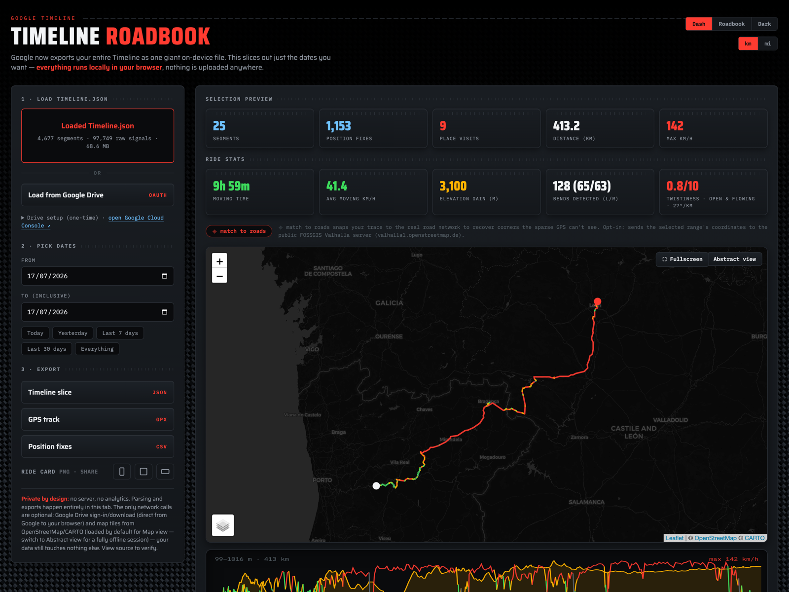

# Google Timeline Visualiser

A single-file, **fully client-side** web tool that turns a Google Timeline export into ride stats, a map, elevation/speed profiles, shareable ride-card PNGs, and GPX/CSV/JSON exports — built for motorcycle touring but useful for any trip.

**→ Live: https://jameslashmar.github.io/Google-Timeline-Visualiser/**



Drop your `Timeline.json` (or a `.gpx` / `.csv`), pick a date range, and get:

- Distance, moving time, average & max speed, elevation gain
- **Bend counts** (L/R split) and a **twistiness score** (°/km), with a best-10 km rolling window — optional "match to roads" recovers the corners sparse GPS misses
- A **speed-coloured map** (real basemap tiles) and an elevation + speed **profile chart**
- **Ride-card PNGs** in three layouts (vertical / square / widescreen), with an optional rider name — share to WhatsApp, Instagram, etc.
- Clean **GPX / CSV / Timeline-slice JSON** exports for just the dates you chose

…plus:

- **Tour summary** — pick a multi-day range for a per-day breakdown (km, twistiness, top speed, bends) and trip totals; click any day to jump to it.
- **Best bit** — one tap frames the twistiest ~10 km of the ride on the map.
- **Stops** — coffee/fuel/lunch stops with durations, pulled straight from the data (no lookups).
- **Rally roadbook** — export rally-style pace notes (distance · direction · severity · angle) as a text file.
- **Compare riders** — drop a mate's GPX/CSV to overlay their track and duel the twistiness scores.
- **Weather** — optional keyless historical weather (temp / rain / wind) for the ride, via Open-Meteo.
- **Flythrough clip** — a WebM of the route drawing on, with live distance & speed, for Stories/Reels.
- **Per-day GPX (ZIP)** — one GPX per day in the range, ready to sync against action-cam footage.
- **Instant reopen** — your last import is cached locally (IndexedDB), so revisiting restores it without re-loading the big file (clearable, never leaves your device).

Everything parses in your browser. **Your location data is never uploaded** — the only network calls are optional and disclosed (map tiles, and the opt-in road-matching request).

---

## Getting your `Timeline.json` out of Google

Google moved Timeline **on-device** in 2024 — the web Timeline is gone and Google Takeout no longer includes it. The only export lives on your phone, and it dumps your **entire** history as one big `Timeline.json` (there's no date filter — this tool does that part).

**Android (Pixel and most phones):**

1. Open **Settings** (the phone's Settings app, not Google Maps).
2. Go to **Location → Location Services → Timeline**
   *(older builds: **Settings → Location → Google Location History/Timeline**).*
3. Tap **Export Timeline data**.
4. Save the `Timeline.json` (to Files, Drive, or share it to your computer).

**iPhone (Google Maps app):**

1. Open **Google Maps** → tap your **profile picture** → **Your Timeline**.
2. Open the **settings** (gear / "Location & privacy settings").
3. Choose **Export Timeline data** and save the `Timeline.json`.

> The file can be ~50–60 MB. That's normal — it's your whole history. This tool loads it locally and slices out only the dates you ask for; nothing is sent anywhere.

Then just open the [live site](https://jameslashmar.github.io/Google-Timeline-Visualiser/) and **drop the file in**.

---

## Also accepts GPX and CSV

You don't need Google Timeline at all — you can drop:

- **`.gpx`** — from an action cam (e.g. Insta360), bike GPS, or any GPS logger. These log far more often than Timeline (often ~10 Hz vs ~1/min), so bend counts and speed colouring are **much more accurate** — no road-matching needed. Per-point speed is read from the file or derived from the track.
- **`.csv`** — re-imports this tool's own CSV export (`timestamp, lat, lng, speed_kmh, altitude, source`). Common column aliases (`latitude`, `lon`, `elevation`, …) are understood too.

Everything downstream — stats, map, profile, ride cards, exports — works identically whatever you drop in.

---

## Privacy

- No server, no analytics, no build step — it's one HTML file.
- Parsing and all exports happen **in your browser tab**.
- The only network calls, all optional and disclosed in the footer:
  - **Map tiles** (OpenStreetMap / CARTO) for the map view — switch to *Abstract view* for a fully offline session.
  - **Road matching** (opt-in button) sends the selected range's coordinates to the public FOSSGIS **Valhalla** server to snap the track to real roads.
- Your `Timeline.json` / GPX / CSV is never uploaded.

---

## Self-hosting (and the Google Drive loader)

The tool is one file — to host it yourself just serve `index.html` from any static host or locally:

```bash
python3 -m http.server 8000 --bind 127.0.0.1
# then open http://localhost:8000
```

> Serve from a folder that does **not** contain your `Timeline.json` if others are on your network.

**Google Drive loading** (pick your `Timeline.json` straight from Drive) is included in the source but is **only shown when you self-host** — it's hidden on the public GitHub Pages site because it needs your own Google Cloud OAuth keys, which is more setup than a casual visitor wants. When you run the source locally (localhost / `file://`), the "Load from Google Drive" button appears. To use it you'll need, in [Google Cloud Console](https://console.cloud.google.com/apis/credentials):

- **Drive API** and **Picker API** enabled
- An **OAuth client ID** (Web application — choose *User data*, not a service account) with your serving origin (e.g. `http://localhost:8000`) as an authorised JavaScript origin
- An **API key** (for the picker)
- Your Google account added as a **test user** on the OAuth consent screen

Enter both keys in the UI (they're stored only in your browser's `localStorage`). The scope is `drive.file` — the app can only see the file you pick, never your whole Drive.

---

## Tech notes

- Leaflet for the map (lazy-loaded from CDN), CARTO/OSM/Esri/OpenTopoMap tiles.
- Road matching via public Valhalla (`trace_route`, motorcycle costing).
- Three built-in themes (Dash carbon-fibre / Roadbook paper / Dark).
- No dependencies to install; no bundler.

## License

MIT — see [LICENSE](LICENSE).
